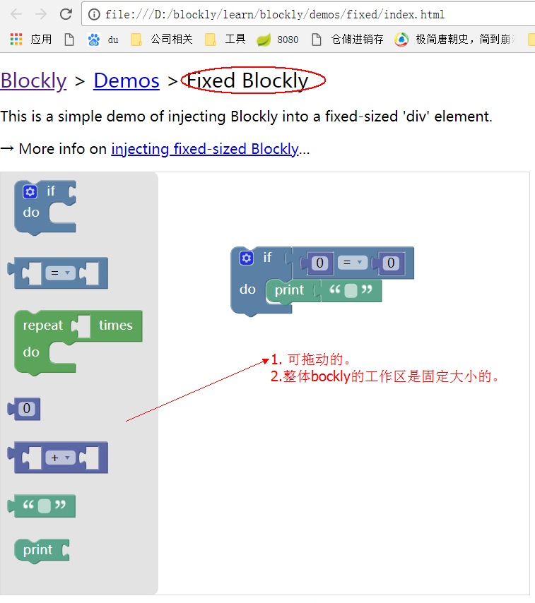
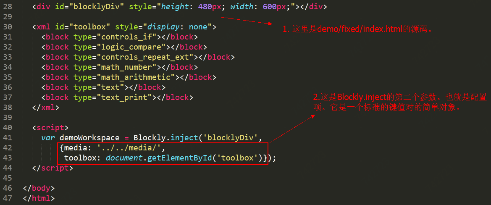

原文:https://developers.google.com/blockly/guides/get-started/web

# 开始使用
本文档面向希望用Blockly作为代码编辑器来创建自己的应用程序的开发人员。对你的要求是熟悉Blockly的用法，并且对HTML和JavaScript有基本了解。

## 概观
Blockly被设计成可以可以非常容易地就安装到您的Web应用程序中。用户拖动各种模块，Blockly生成代码，你的应用程序用这些代码做一些事情。从您的应用程序的角度来看，Blockly仅仅是一个textarea，用户在其中输入入语法上完美的JavaScript，Python，PHP，Lua，Dart或其他语言。只不是代码输入的过程是用拖动模块来代替了传统的键盘录入。

Blockly是100％的客户端，不需要服务器的支持（除非有人想使用云存储功能）。没有第三方依赖关系（除非有人想重新编译核心）。一切都是开源的。

## 获取代码
首先，从GitHub下载源代码。如果您知道如何使用Git或Subversion，我们强烈建议从我们的存储库进行同步，以便您的代码保持最新状态。
- [下载zip](https://github.com/google/blockly/zipball/master)
- [下载TAR](https://github.com/google/blockly/tarball/master)
- [gitHub](https://github.com/google/blockly)

代码下载完成后，用浏览器打开demos/fixed/index.html，验证一下模块是否可以拖动？



### 注入blockly

在您的Blockly verified工作安装中，Blockly被注入到网页中的一个固定大小的div中。

- 更多有关[固定大小Blockly](https://developers.google.com/blockly/guides/configure/web/fixed-size) 的信息

在一些高级应用中，我们可能希望允许Blockly调整大小以填充整个页面。

- 更多关于[大小可变的Blockly](https://developers.google.com/blockly/guides/configure/web/resizable)的信息

### 配置

上面的demo文件中，调用了Blockly.inject()方法，它的第一个参数是要注入的div元素，第二个参数是配置项，如下示。


配置项支持以下选项：

|    名称    | 类型 |  描述 |
| ---------- | --- | --- |

|collapse|	布尔 |	允许块被折叠或展开。如果工具箱有类别默认为true|
|comments|	布尔 |	允许块有评论(comments)。如果工具箱有类别默认为true|
|css|	布尔 |	如果为false，则不要注入CSS（从文档中获取css）。默认为true。|
|disable|	布尔 |	允许块被禁用。如果工具箱有类别默认为true。|
|grid|	object |	配置网格。请参阅网格 ...|
|horizontalLayout|	布尔 | 	如果是true，工具箱是水平的；如果false，则工具箱是垂直的。默认为false。|
|maxBlocks|	number |	可以创建的最大模块数。对学生的练习很有用。默认为Infinity。|
|media|	string |	从页面（或frame）到Blockly媒体目录的路径。默认为。"https：//blockly-demo.appspot.com/static/media/"|
|oneBasedIndex|	布尔	|如果true,列表和字符串操作的索引从1开始，如果false，则索引从0开始。默认为true。|
|readOnly|	布尔 |	如果true，阻止用户进行编辑。废除工具箱和垃圾桶。默认为false。|
|rtl|	布尔 |	如果true，翻转编辑器（阿拉伯语或希伯来语语言环境）。请参阅[RTL演示](https://blockly-demo.appspot.com/static/demos/rtl/index.html)。默认为false。|
|scrollbars|	布尔 |	设置工作区是否可滚动。如果工具箱有类别默认为true，否则默认为false。|
|sounds|	布尔	 | 如果false，不播放声音（例如点击和删除）。默认为true。|
|toolbox|	XML节点	| 用户可用的类别和块的树结构。请参阅下面的详细信息。|
|toolboxPosition|	string | 确定工具箱的位置，可取"start"或者"end"。与水平、垂直布局及RTL设置有关。默认为"start"。|
trashcan|	布尔	| 显示或隐藏垃圾桶。如果工具箱有类别默认为true,否则为false。|
|zoom|	object | 	配置缩放行为。请[参阅](https://developers.google.com/blockly/guides/configure/web/zoom)

上面的配置项中最重要的选项是toolbox。它是一个XML树结构，用于指定工具箱中哪些块可用（侧面菜单），它们如何分组以及是否存在类别。有关[定义工具箱的更多信息](https://developers.google.com/blockly/guides/configure/web/toolbox)

除了Blockly自带的默认模块以外，还需要构建*自定义模块*来调用你自己的Web应用程序的API。在[迷宫游戏](https://blockly-games.appspot.com/maze)中你可以看到有设置运动的自定义模块。更多关于[*创建自定义模块的信息*](https://developers.google.com/blockly/guides/create-custom-blocks/overview)

## 代码生成器
Blockly不是一种编程语言，我们不能直接'运行'Blockly程序，事实上，Blockly可以把用户的程序转换为JavaScript，Python，PHP，Dart或其他语言。然后，你再去运行这些编译语言。
```
	用户在blockly中拖拽组合模块 --blockly---> 各种编程语言（JavaScript，Python，PHP，Dart）
```

-->[更多关于代码生成器的信息](https://developers.google.com/blockly/guides/configure/web/code-generators)

## 导入和导出块
### 导出
如果您的应用程序需要保存并存储用户模块信息，并在后面再次访问时将其恢复，则需要使用此调用导出为XML：
```
var xml = Blockly.Xml.workspaceToDom(workspace); 
var xml_text = Blockly.Xml.domToText(xml) 
```
这将产生一个最小（但很丑）的字符串,在这个字符串中包含了用户模块的XML结构。如果希望获得更易读（但更大）的字符串，请改用Blockly.Xml.domToPrettyText()。
### 导入
从XML字符串中恢复到块的过程非常简单：
```
var xml = Blockly.Xml.textToDom(xml_text）;
 Blockly.Xml.domToWorkspace(xml ，workspace ）; 
```
## 云储存
Blockly提供可选的云存储功能。它使用户能够保存，加载，共享和发布他们的程序。如果您的项目托管在App Engine上，则可以利用此服务。

→有关云端存储的更多信息[...](https://developers.google.com/blockly/guides/configure/web/cloud-storage)