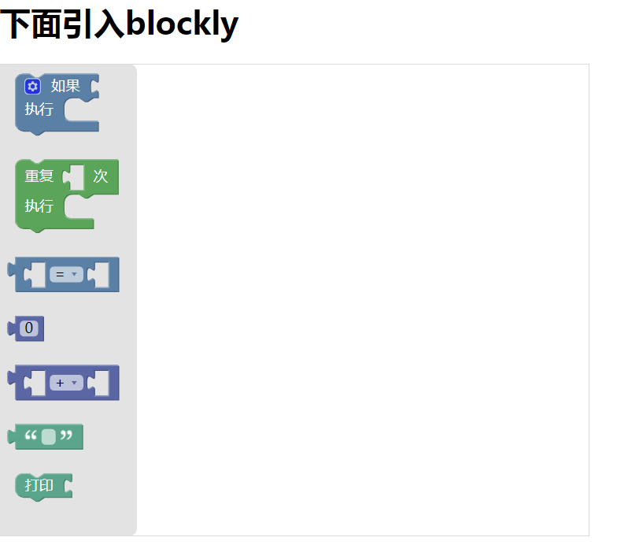
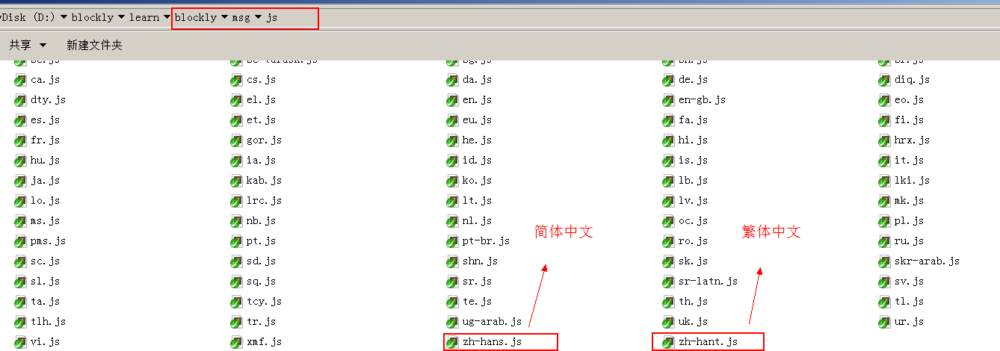

原文：https://developers.google.com/blockly/guides/configure/web/fixed-size

# 固定大小的工作区
在web中使用blockly的最简单方法是将其注入空的“div”标签中。

## 注入

### 第一步：引入核心Blockly脚本和核心块集。
在html文件中，引入两个js文件：
```
<script src = "blockly_compressed.js"> </ script> 
<script src = "blocks_compressed.js"> </ script> 
```
请注意：路径可能会有所不同，具体取决于您的页面与Blockly相关的位置。

### 第二步：引入用户语言的文件 
以英文为例：
```
<script src = "msg/js/en.js"></ script> 

```
### 第三步：在html中创建一个div，用来引入blockly
在页面正文的某处添加一个空div,并**设置其大小**：
```
<div id="blocklyDiv" style="height:480px; width:600px;"> </div>     
```
上面的width,height都是必须要设置的，如果不设置，则在本例中效果就不会出来。
### 第四步：添加工具箱结构
在页面的任何位置添加工具箱的结构（请参阅[定义工具箱](https://developers.google.com/blockly/guides/configure/web/toolbox)以获取更多信息）：
```
<xml id="toolbox" style="display: none">
  <block type="controls_if"></block>
  <block type="controls_repeat_ext"></block>
  <block type="logic_compare"></block>
  <block type="math_number"></block>
  <block type="math_arithmetic"></block>
  <block type="text"></block>
  <block type="text_print"></block>
</xml>
```
注意：
1. display:none。表示它在页面上不可见，只是为后面的Blockly.inject提供工具箱的结构，它本身不需要要出现在页面上。
2. 上面定义了7个块，每个块都有不同的type。你可以根据它们的type值猜到它们的作用。

### 第五步：激活blockly
最后，通过以下代码将Blockly插入到空的div中。
```
<script>
  var workspacePlayground = Blockly.inject('blocklyDiv',
      {toolbox: document.getElementById('toolbox')});
</script>
```
注意：
1. 这里的代码应位于页面底部，或由onload事件调用。
2. 在上面的代码中，变量workspacePlayground当前未使用，但在后续如果想要保存模块或生成代码时它将被用到。
3. 如果多个Blockly实例被注入同一页面（调用了多次Blockly.inject()），请确保每个返回的工作空间都存储在不同的变量中。

### 第六步：查看效果

此时，在浏览器中测试页面。您应该看到Blockly的编辑器在工具箱中填充了七个块，这些块就是在第四步中指定的块。



上图中的效果是由于如下代码生成的：
```
<!DOCTYPE html>
<html>
<head>
	<title></title>
</head>
<body>
	<script src="https://blockly-demo.appspot.com/static/blockly_compressed.js"></script>
	<script src="https://blockly-demo.appspot.com/static/blocks_compressed.js"></script>
	<script src="https://blockly-demo.appspot.com/static/msg/js/zh-hans.js"></script>
	<h1>下面引入blockly</h1>
	<div id="blocklyDiv" style="height:480px; width:600px;"> </div>  

	<!-- 工具箱 -->
	<xml id="toolbox" style="display: none">
	  <block type="controls_if"></block>
	  <block type="controls_repeat_ext"></block>
	  <block type="logic_compare"></block>
	  <block type="math_number"></block>
	  <block type="math_arithmetic"></block>
	  <block type="text"></block>
	  <block type="text_print"></block>
	</xml> 
	
	<script type="text/javascript">
  		var workspace = Blockly.inject('blocklyDiv',
      		{toolbox: document.getElementById('toolbox')});
	</script>
</body>
</html>
```
注意：
1. 语言由en.js改成zh-hans.js（简体中文）。这个文件名zh-hans有点奇怪：zh表示中国，han表示“汉”，s表示simaple 。其它语言如下图示：

2. 从官网上引入核心Blockly脚本，核心块及语言文件。
