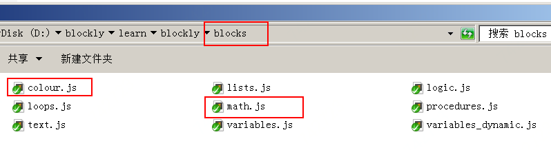
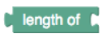
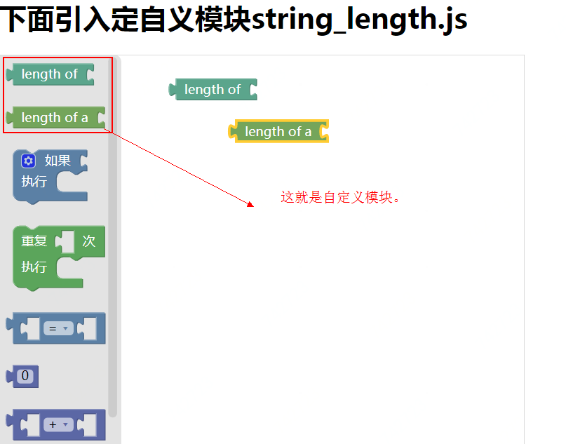

原文：https://developers.google.com/blockly/guides/configure/web/custom-blocks

# 添加自定义块
虽然Blockly定义了许多标准块，但大多数应用程序需要定义和实现至少几个与实际应用相关的块。

## 块的组成
块由三部分组成：

1. 块定义对象：定义块的外观和行为，包括文本，颜色，字段和连接。
2. 工具箱引用：对工具箱XML中块类型的引用，以便用户可以将其添加到工作区。
3. 生成器函数：生成这个模块所表示的代码串。它总是使用JavaScript来编写， 即使目标语言不是JavaScript，甚至是Blockly for Android。

下面以定义一个“获取输入的字符串长度”的块分别来介绍这三个部分。

### 块定义
阻止网络负载通过脚本文件加载块。在你下载的blockly的文件中的"blocks/"目录下，就包括几个块定义的例子，当然它们是为标准块服务的。



假设你的块不适合现有的类别，则你需要创建一个新的JavaScript文件，这个新的JavaScript文件随后也要以引入script标签的方式 引入到使用blockly的HTML文件中。

>注意：大多数的块可以使用Blockly Developer Tools来定义，而不是手动创建下面的代码去定义。
典型的块定义如下所示：
分成两种写法，json格式 和纯javascrpit格式 
#### JSON格式 
```
Blockly.Blocks['string_length'] = {
  init: function() {
    this.jsonInit({
      "message0": 'length of %1',
      "args0": [
        {
          "type": "input_value",
          "name": "VALUE",
          "check": "String"
        }
      ],
      "output": "Number",
      "colour": 160,
      "tooltip": "Returns number of letters in the provided text.",
      "helpUrl": "http://www.w3schools.com/jsref/jsref_length_string.asp"
    });
  }
};
```
#### Javascript格式 
```
Blockly.Blocks['string_length'] = {
  init: function() {
    this.appendValueInput('VALUE')
        .setCheck('String')
        .appendField('length of');
    this.setOutput(true, 'Number');
    this.setColour(160);
    this.setTooltip('Returns number of letters in the provided text.');
    this.setHelpUrl('http://www.w3schools.com/jsref/jsref_length_string.asp');
  }
};
```
说明：
1. string_length：这是块的类型名称。由于所有块共享相同的命名空间，因此使用由类别名（在本例中string）+ 块的函数名（在本例中 length）是一种很好的命名方式。

2. init：这个函数定义了块的外观和感觉。

上面的代码定义块如下：


关于块定义的更多细节可以在[定义块](https://developers.google.com/blockly/guides/create-custom-blocks/define-blocks)中找到 。

ok,上面已经定义了一个块，下面把它添加到工具箱中。

### 添加工具箱引用 

1. 完成定义：写在一个单独的js文件中。
2. 在当前的html文件中引用这个js文件。
3. 直接使用类型名称将该块引用到工具箱中。

```
<xml id="toolbox" style="display: none">
    <block type="string_length"></block>
</xml>
```

有关更多详细信息,请参阅 [工具箱指南](https://developers.google.com/blockly/guides/configure/web/toolbox).

### 添加生成器函数
最后，要将该模块转换为代码，需要将该模块与生成器函数配对。生成器而具体的输出语言而异，但标准生成器通常采用以下格式：
```
Blockly.JavaScript['text_length'] = function(block) {
  // String or array length.
  var argument0 = Blockly.JavaScript.valueToCode(block, 'VALUE',
      Blockly.JavaScript.ORDER_FUNCTION_CALL) || '\'\'';
  return [argument0 + '.length', Blockly.JavaScript.ORDER_MEMBER];
};
```
生成器函数对块进行引用以进行处理。它将输入（上面的VALUE输入框）渲染为代码串，然后将这些代码串连接成更大的表达式。

请参阅[使用自定义生成器](https://developers.google.com/blockly/guides/create-custom-blocks/generating-code) 了解更多详细信