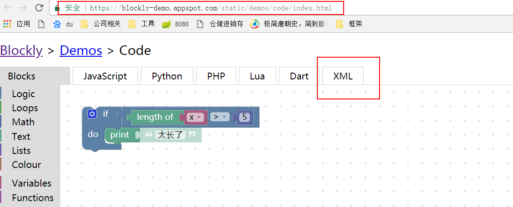

原文：https://developers.google.com/blockly/guides/configure/web/toolbox

# 工具箱
工具箱是一个侧边菜单，用户可以从中拖动工作到右边的工作区来使用块。


工具箱的结构由XML指定，可以是节点树，也可以是字符串表示形式。这个XML在注入页面时被传递给Blockly。如果您不喜欢手动输入XML，我们建议您查看[Blockly Developer Tools](https://developers.google.com/blockly/guides/create-custom-blocks/blockly-developer-tools)。有了它，您可以构建工具箱并使用可视界面自动生成工具箱XML。

这是使用节点树的一个最简例子(省略了其它不必要的代码)：
```
<xml id="toolbox" style="display: none">
  <block type="controls_if"></block>
  <block type="controls_whileUntil"></block>
</xml>
<script>
  var workspace = Blockly.inject('blocklyDiv',
      {toolbox: document.getElementById('toolbox')});
</script>
```
以下是使用字符串表示形式的相同示例：
```
<script>
  var toolbox = '<xml>';
  toolbox += '  <block type="controls_if"></block>';
  toolbox += '  <block type="controls_whileUntil"></block>';
  toolbox += '</xml>';
  var workspace = Blockly.inject('blocklyDiv', {toolbox: toolbox});
</script>
```
上述两者都创建了两个块的相同工具箱：


如果模块的数量很少，那么它们可能不需要没有任何的类别显示（如上面的最小示例）。在这种简单的模式下，所有可用的块都显示在工具箱中，主工作区没有滚动条，垃圾桶也不需要。

但是，如果模块很多，则需要对它们进行分类放置。

## 分类
工具箱中的块可以按类别进行组织。如下示例中有两个类别（'Control'和'Logic'），每个类别包含三个块：
```
<xml id="toolbox" style="display: none">
  <category name="Control">
    <block type="controls_if"></block>
    <block type="controls_whileUntil"></block>
    <block type="controls_for">
  </category>
  <category name="Logic">
    <block type="logic_compare"></block>
    <block type="logic_operation"></block>
    <block type="logic_boolean"></block>
  </category>
</xml>
```
下面是生成的工具箱，单击“逻辑”类别，以便可以看到弹出窗口中的三个逻辑块：


通过分类别对模块进行管理，改变了Blockly的UI面板以支持更大的应用程序。滚动条的出现，允许无限大的工作空间。上下文菜单包含更多高级选项，例如添加注释或折叠块。所有这些功能都可以使用[配置选项](https://developers.google.com/blockly/guides/get-started/web#configuration)覆盖定义。

通用使用colour属性，你可以给每个类别都可以分配一种颜色。注意英国的拼写（不是color）。颜色是通过（0-360）的数字来定义hue。
```

<xml id="toolbox" style="display: none">
  <category name="Logic" colour="210">...</category>
  <category name="Loops" colour="120">...</category>
  <category name="Math" colour="230">...</category>
  <category name="Colour" colour="20">...</category>
  <category name="Variables" colour="330" custom="VARIABLE"></category>
  <category name="Functions" colour="290" custom="PROCEDURE"></category>
</xml>
```
你会注意上面的代码中，除了colour属性之外，还有一个属性custom。这个属性会在下面介绍。
此颜色显示为类别左侧的矩形，并作为当前选定类别的突出显示：

在[这里](http://runjs.cn/code/tfk4hnhi)查看效果，也可以在此基础上进行编辑。

## 动态类别
在blockly中有两个类别具有特殊行为。它们是：变量和函数类别。 它们并没有指定的某些模块作为它们的内容项，但都 具有一个名为'custom'属性 。custom的属性的值可能是"VARIABLE"或者是"PROCEDURE"。这两个类别将使用适当的块去自动填充。所以称为动态类别：即它的模块不是固定的，而是动态的。
```
<category name="Variables" custom="VARIABLE"></category>
<category name="Functions" custom="PROCEDURE"></category>
```
注意：'程序'一词在整个Blockly代码库中都使用，但'函数'这个词已经被学生理解。抱歉不匹配。

开发人员也可以使用该custom属性来创建动态填充的弹出窗口类别。例如，要创建具有一组自定义颜色块的弹出窗口，请执行以下操作：

1. 使用custom属性创建一个类别。
```
<category name="Colours" custom="COLOUR_PALETTE"></category>
```
上面的COLOUR_PALETTE是需要自定义的。
2.定义回调以提供类别内容。该回调应该在工作区中并返回一个XML块元素数组。
```
/**
 * Construct the blocks required by the flyout for the colours category.
 * @param {!Blockly.Workspace} workspace The workspace this flyout is for.
 * @return {!Array.<!Element>} Array of XML block elements.
 */
myApplication.coloursFlyoutCallback = function(workspace) {
  // Returns an array of hex colours, e.g. ['#4286f4', '#ef0447']
  var colourList = myApplication.getPalette();
  var xmlList = [];
  if (Blockly.Blocks['colour_picker']) {
    for (var i = 0; i < colourList.length; i++) {
      var blockText = '<xml>' +
          '<block type="colour_picker">' +
          '<field name="COLOUR">' + colourList[i] + '</field>' +
          '</block>' +
          '</xml>';
      var block = Blockly.Xml.textToDom(blockText).firstChild;
      xmlList.push(block);
    }
  }
  return xmlList;
};
```
3. 在工作区注册回调。
```
myWorkspace.registerToolboxCategoryCallback(
  'COLOUR_PALETTE', myApplication.coloursFlyoutCallback);
```

**以上代码会报错：myApplication没有定义，目前还没有解决**

## 树形分类

类别可以嵌套在其他类别中，这样就会形成一颗树。

以下是两个顶级类别（'Core'和'Custom'），每个类别包含两个子类别，每个子类别包含一些块：
```
<xml id="toolbox" style="display: none">
  <category name="Core">
    <category name="Control">
      <block type="controls_if"></block>
      <block type="controls_whileUntil"></block>
    </category>
    <category name="Logic">
      <block type="logic_compare"></block>
      <block type="logic_operation"></block>
      <block type="logic_boolean"></block>
    </category>
  </category>
  <category name="Custom">
    <block type="start"></block>
    <category name="Move">
      <block type="move_forward"></block>
      <block type="move_backward"></block>
    </category>
    <category name="Turn">
      <block type="turn_left"></block>
      <block type="turn_right"></block>
    </category>
  </category>
</xml>
```
在[这里](http://runjs.cn/code/bjzsjobr)查看效果
请注意，类别可能包含子类别和块。在上面的例子中，'Custom'有两个子类别（'Move'和'Turn'），以及它自己的一个块（'start'）。

加载Blockly时，嵌套的类别默认显示为折叠状态，也可以通过expanded属性来设置展开。如下：
```
<category name="..." expanded="true">。
```
# 块组

XML可能包含自定义块或块组。这里有四个块及其代码：

1. 一个简单的logic_boolean块：

```
<block type="logic_boolean"></block>
```
2. 一个设置初值为42的math_number块（缺省值为0）：

```
  <block type="math_number">
    <field name="NUM">42</field>
  </block>
```
3. 一个controls_for块，它连接三个math_number块：

```
<block type="controls_for">
    <value name="FROM">
      <block type="math_number">
        <field name="NUM">1</field>
      </block>
    </value>
    <value name="TO">
      <block type="math_number">
        <field name="NUM">10</field>
      </block>
    </value>
    <value name="BY">
      <block type="math_number">
        <field name="NUM">1</field>
      </block>
    </value>
  </block>
```
4. 一个math_arithmetic块，它有两个math_number ，这两个math_number块用阴影块连接：

```
<block type="math_arithmetic">
    <field name="OP">ADD</field>
    <value name="A">
      <shadow type="math_number">
        <field name="NUM">1</field>
      </shadow>
    </value>
    <value name="B">
      <shadow type="math_number">
        <field name="NUM">1</field>
      </shadow>
    </value>
  </block>
```
这些自定义块或组的XML与Blockly的XML保存格式相同。因此，为这些块构建XML的最简单方法是使用 [Code application ](https://blockly-demo.appspot.com/static/demos/code/index.html)去构建块，然后切换到XML选项卡并复制结果。该x， y和id属性被工具箱忽略，并可能被删除。如下：


阴影块
阴影块是占位符块，可执行多种功能：

它们指示其父区块的默认值。
它们允许用户直接键入值，而不需要获取数字或字符串块。
与常规块不同，如果用户在其上放置块，则会被替换。
他们通知用户预期的价值类型。
无法直接使用代码应用程序构建阴影块。相反，可以使用常规块，然后更改<block ...>并</block>在XML中<shadow ...>和</shadow>。

注意：阴影块可能不包含变量字段或具有不是阴影的子项。
除铁器
<sep></sep>在任何两个类别之间添加标签将创建一个分隔符。


默认情况下，每个块与其下邻居分开24个像素。这种分离可以使用'gap'属性来改变，它将取代默认的差距。

<xml id="toolbox" style="display: none">
  <block type="math_number"></block>
  <sep gap="32"></sep>
  <block type="math_arithmetic">
    <field name="OP">ADD</field>
  </block>
  <sep gap="8"></sep>
  <block type="math_arithmetic">
    <field name="OP">MINUS</field>
  </block>
</xml>
调整块之间的间隙允许在工具箱中创建块的逻辑组。


按钮和标签
您可以在任何可以将块放入工具箱的位置放置按钮或标签。

<xml id="toolbox" style="display: none">
  <block type="logic_operation"></block>
  <label text="A label" web-class="myLabelStyle"></label>
  <label text="Another label"></label>
  <block type="logic_negate"></block>
  <button text="A button" callbackKey="myFirstButtonPressed"></button>
  <block type="logic_boolean"></block>
</xml>

<style>
.myLabelStyle>.blocklyFlyoutLabelText {
  font-style: italic;
  fill: green;
}
</style>


您可以指定一个CSS类名称以应用于您的按钮或标签。在上例中，第一个标签使用自定义样式，而第二个标签使用默认样式。

按钮应该有回调函数; 标签不应该。要为给定的按钮单击设置回调，请使用

yourWorkspace.registerButtonCallback(yourCallbackKey, yourFunction).
你的函数应该接受被点击的按钮作为参数。变量类别中的“创建变量...”按钮是一个带回调按钮的好例子。

残
使用可选disabled 属性可以单独禁用工具箱中的块：

<xml id="toolbox" style="display: none">
  <block type="math_number"></block>
  <block type="math_arithmetic"></block>
  <block type="math_single" disabled="true"></block>
</xml>
禁用块可用于限制用户的选择。也许高级块可能会在取得某些成就后解锁。


更改工具箱
应用程序可随时通过单个函数调用更改工具箱中可用的块：

workspace.updateToolbox(newTree);
与初始配置期间的情况一样，newTree可以是节点树或字符串表示。唯一的限制是模式不能改变; 也就是说，如果最初定义的工具箱中有类别，那么新的工具箱也必须具有类别（尽管类别可能会更改）。同样，如果最初定义的工具箱没有任何类别，那么新的工具箱可能没有任何类别。

请注意，此时更新工具栏会导致一些较小的UI重置：

在包含类别的工具箱中，弹出窗口在打开时会关闭。
在没有类别的工具箱中，用户更改的任何字段（如下拉列表）将恢复为默认值。
任何工具箱只要延伸到页面之外，其滚动条都会跳到顶部。
这是一个带有类别和块组的树的现场演示。